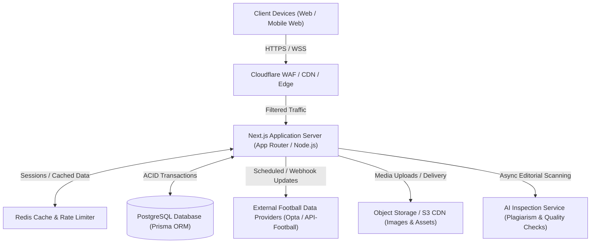
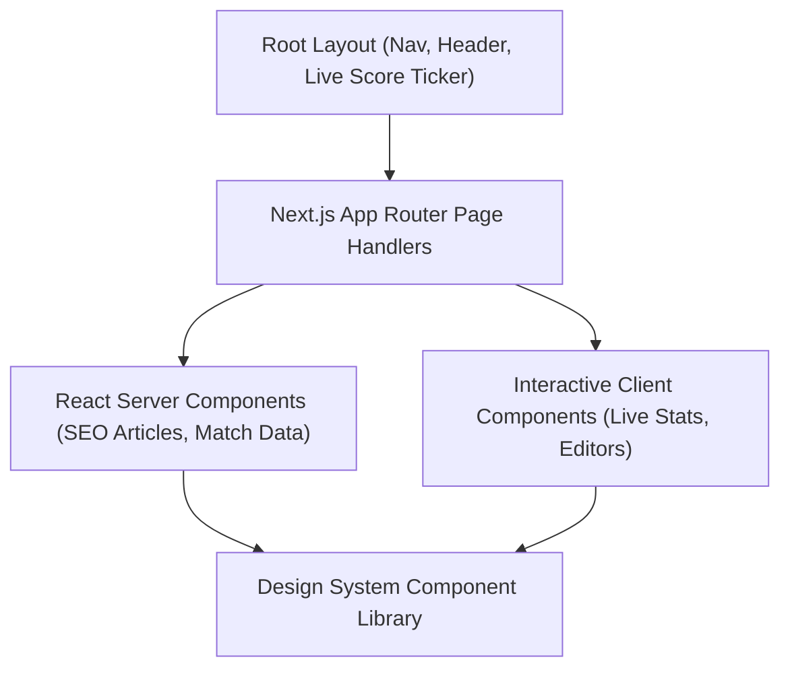
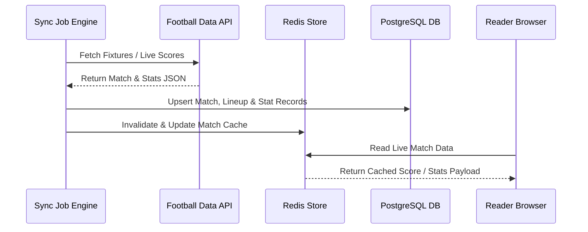
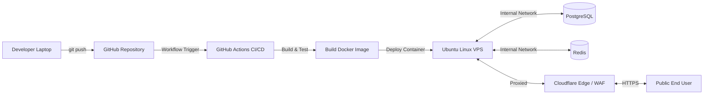

# System Architecture Specification — Football Media Platform

> **VERSION**: 1.0.0  
> **STATUS**: Base Architecture Blueprint  
> **PRIMARY SPECIFICATION**: Football Media Platform PRD v1.0

---

## 1. System Architecture Overview

The Football Media Platform is architected as a high-performance, modular monolith using Next.js App Router, powered by PostgreSQL for transactional persistence, Redis for multi-tier caching and rate limiting, and Cloudflare for edge security and CDN delivery.



---

## 2. Frontend Architecture

The frontend follows Next.js App Router paradigms with a server-first mindset:

- **Server Components (RSC)**: Used for all primary content rendering (articles, match center pages, standings, player profiles) to maximize SEO performance and minimize JavaScript bundle payload.
- **Client Components**: Isolated exclusively to interactive widgets (live match ticker score updates, tab toggles, comment inputs, contributor submission forms, admin dashboard filters).
- **State Management**: Server state managed via Next.js cache and standard React hooks (`useOptimistic`, `useTransition`) for client interactions.
- **UI & Layout System**: Component-driven architecture using Tailwind CSS, structured with atomic components (Atoms, Molecules, Organisms).



---

## 3. Backend Architecture

The backend is built as a **Modular Monolith** within the Next.js runtime environment, ensuring clear separation of domain concerns:

```
src/
├── app/                  # Next.js App Router (Routes & Server Actions)
│   ├── (public)/         # Reader-facing routes (Articles, Match Center)
│   ├── (contributor)/    # Contributor Portal (Editor, Earnings, Stats)
│   ├── (admin)/          # Editorial & Admin Operations Portal
│   └── api/              # Secure REST Route Handlers
├── modules/              # Domain Bounded Contexts
│   ├── auth/             # Session, Password Hashing, RBAC
│   ├── content/          # Articles, Revisions, Categories, Tags
│   ├── editorial/        # Editorial Workflow, Reviews, AI Inspection
│   ├── football/         # Matches, Teams, Players, Standings, Sync Engine
│   ├── contributor/      # Profile, Tier Level, Submission Metrics
│   ├── rewards/          # View Tracking, Revenue Pool, Earnings Algorithm
│   ├── payouts/          # Wallet, Payout Requests, Audit Trails
│   └── advertising/      # Ad Units, Placements, Impression Analytics
└── shared/               # Shared Utilities (Prisma Client, Redis, Logger)
```

---

## 4. Database Architecture

- **Engine**: PostgreSQL 16+
- **ORM**: Prisma ORM with strict migration management.
- **Pooling**: PgBouncer / Prisma Accelerate connection pooling for high-concurrency read operations.
- **Caching Layer**: Redis L2 caching for frequent reads (match standings, featured news, player cards).

---

## 5. Football Data Architecture

Integrates third-party football data feeds (fixtures, live scores, lineups, player statistics, league standings) into a unified relational model.



---

## 6. Contributor Architecture

Allows registered sports writers and analysts to submit draft articles for editorial review.

- **Writer Tiers**: Junior, Regular, Senior, Expert (affects approval requirements and revenue share multipliers).
- **Submission Workflow**: Draft -> Submitted -> Pending Editorial Review -> Approved/Published OR Rejected with Feedback.
- **Analytics Dashboard**: Writers track live reader views, reading duration, engagement scores, and accrued rewards.

---

## 7. Editorial Architecture

The editorial department operates a multi-stage review queue:

- **Revision Tracking**: Every modification generates an immutable `article_revisions` record.
- **Editorial Assignments**: Editors-in-Chief can assign articles to specific editors.
- **Approval Engine**: Validates metadata, category placement, tag consistency, and featured image licensing before publication.

---

## 8. AI Editorial Architecture

Automated quality control before an editor reviews an article:

- **Plagiarism Scanner**: Hashes incoming article text against internal publication index and web search API to calculate uniqueness score.
- **Quality & Fact Checks**: Automated check for required source links, minimum word counts, clickbait title warnings, and formatting validation.
- **Image Compliance**: Ensures uploaded cover images have correct attribution metadata and standard aspect ratios.

---

## 9. Advertising Architecture

Strategic monetization framework designed to preserve reading experience:

- **Ad Units**: Header Leaderboard, In-Article Sticky Rectangles, Sidebar Units, Match Center Sponsor Badges.
- **Ad Placements**: Controlled server-side to prevent cumulative layout shift (CLS).
- **Lazy Loading**: Client-side IntersectionObserver loads ads only when approaching viewport.

---

## 10. Reward Architecture

Determines contributor payouts based on genuine audience engagement:

$$\text{Earnings} = \left( \frac{\text{Validated Views}}{1000} \right) \times \text{Base CPM} \times \text{Tier Multiplier} \times \text{Quality Index}$$

- Anti-Fraud Engine: Filters bot traffic, rapid refresh spam, and zero-duration clicks using Redis IP rate-tracking and session fingerprinting.

---

## 11. Payout Architecture

Manages contributor balances and withdrawal executions:

- **Ledger System**: Double-entry ledger records all earnings credits and payout debits.
- **Withdrawal Requests**: Contributor submits payout request once minimum threshold (e.g., \$50) is reached.
- **Approval Workflow**: Admin reviews payout request -> Dispatches payout via manual/automated gateway -> Records transaction reference and immutable audit log.

---

## 12. Security Architecture

- **WAF & Edge Protection**: Cloudflare filters DDoS attacks, SQLi, and malicious bots.
- **Authentication**: HTTP-only secure cookies with JWT/session token verification on server side.
- **Authorization**: RBAC middleware checks roles and permissions before executing Server Actions or API routes.
- **Audit Logging**: Sensitive actions (role grants, published articles, payouts) are written to immutable audit logs.

---

## 13. Deployment Architecture


